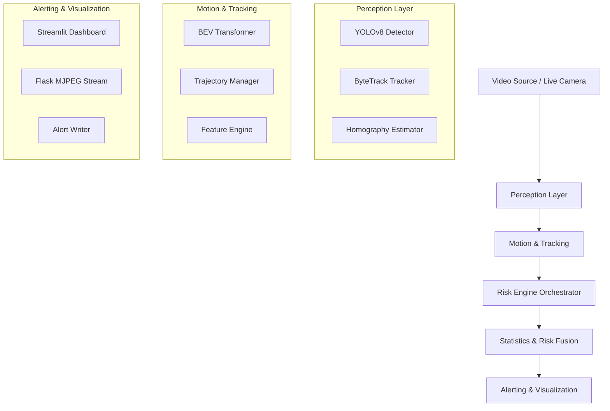

# Codebase Overview - almond-4

This document provides a structural overview of the **almond-4** Highway Hazard Detection system, detailing its components, AI pipeline, and data flow.

## 🏗️ System Architecture

The system is designed as a modular pipeline that converts raw video frames into actionable risk metrics and alerts.

## 📂 Directory Structure & Responsibilities

### 1. Root Components
- **[app.py](file:///c:/Users/liewz/Documents/GitHub/enam-tujuh/almond-4/app.py)**: Entry point for the Flask-based real-time API.
- **[main.py](file:///c:/Users/liewz/Documents/GitHub/enam-tujuh/almond-4/main.py)**: Command-line entry point for batch processing and research.
- **[config.yaml](file:///c:/Users/liewz/Documents/GitHub/enam-tujuh/almond-4/config.yaml)**: Central configuration hub for all AI thresholds, weights, and paths.
- **[config.py](file:///c:/Users/liewz/Documents/GitHub/enam-tujuh/almond-4/config.py)**: Python wrapper to safely load and provide configuration values.

### 2. Core Modules (`/core`)
This directory contains the primary logic for the hazard detection pipeline.

- **`engine.py`**: The central orchestrator (**`RiskEngine`**). It coordinates data flow between perception, motion, and statistical modules for every frame.
- **`detector.py`**: Wrapper for the YOLOv8 object detection model.
- **`tracker.py`**: Implements vehicle tracking over time (ByteTrack).
- **`video_processor.py`**: Handles video file reading and frame-by-frame extraction using OpenCV.
- **`alert_writer.py`**: Manages the persistence of alert data and snapshots.

### 3. Perception Layer (`/core/perception`)
- **`homography.py`**: **`HomographyEstimator`**. Dynamically calculates the mapping between camera pixels and a top-down Bird's Eye View (BEV) using lane detection and vanishing point analysis.
- **`bev_transform.py`**: **`BEVTransformer`**. Projects vehicle coordinates into the BEV space using the homography matrix.

### 4. Motion Analysis (`/core/motion`)
- **`trajectory_manager.py`**: Maintains historical trajectories for all tracked vehicle IDs in BEV space.
- **`features.py`**: **`FeatureEngine`**. Computes complex motion metrics like SDLP (swerving), Steering Entropy, and Acceleration Jerk from trajectories.
- **`smoothing.py`**: Applies temporal filters (e.g., Savitzky-Golay) to raw trajectories to reduce noise.

### 5. Statistical Risk Engine (`/core/statistics`)
- **`robust_baseline.py`**: **`OnlineRobustBaseline`**. Learns "normal" driving patterns dynamically to detect deviations without manual calibration.
- **`probability.py`**: Maps raw motion features to probability scores based on the learned baseline distributions.
- **`risk_fusion.py`**: **`RiskFusionEngine`**. Fuses multiple feature probabilities into a single risk score (0.0 - 1.0) using weighted averaging.

### 6. User Interfaces
- **`/app`**: Contains the Streamlit dashboard (`streamlit_app.py`) for visual playback and interactive tuning.
- **`/api`**: Contains Flask routes (`routes.py`) for RESTful access to system state and MJPEG streams.
- **`/workers`**: Contains background execution logic (`camera_worker.py`) for live stream handling.

## 🔄 Data Pipeline Flow

1.  **Ingestion**: Frames are captured via `VideoProcessor` or `CameraWorker`.
2.  **Tracking**: `Tracker` detects and assigns IDs to vehicles.
3.  **Projection**: `HomographyEstimator` updates the road mapping; `BEVTransformer` projects vehicle centers onto the BEV grid.
4.  **Feature Extraction**: `FeatureEngine` calculates driving behavior metrics from BEV trajectories.
5.  **Scoring**: `RiskFusionEngine` compares metrics against the `OnlineRobustBaseline` to produce a risk score.
6.  **Action**: If risk > threshold, `AlertWriter` logs the event and saves a snapshot.
